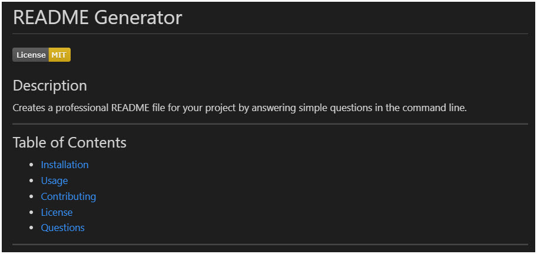

# README Generator

## Description

Creates a professional README file for your project by answering simple questions in the command line. Also provides license badges and the ability to add an image to the README.

---

## Table of Contents

- [Installation](#installation)
- [Usage](#usage)
- [Contributing](#contributing)
- [License](#license)
- [Questions](#questions)

---

## Installation

In order to use the README Generator, you must

- Clone the respository and install the required modules via npm install.
- Currently the application creates the README.md file in the 'dist' folder along side the index.js file. Create this folder prior to running.

---

## Usage

Free to use as needed.

---

## Contributing

Provide contributions with a link to this respository.

---

## Tests

No current tests.

---

## License

This project is covered under the license: [MIT License](https://opensource.org/licenses/MIT)

---

## Questions

Please contact the owner with any questions.
Email: yiladien@hotmail.com
GitHub profile: https://github.com/Yiladien

---
